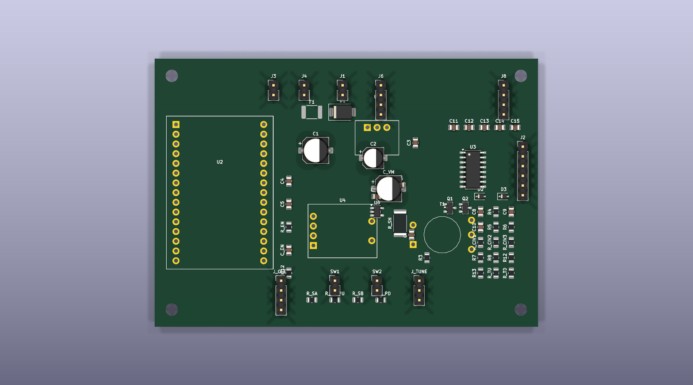
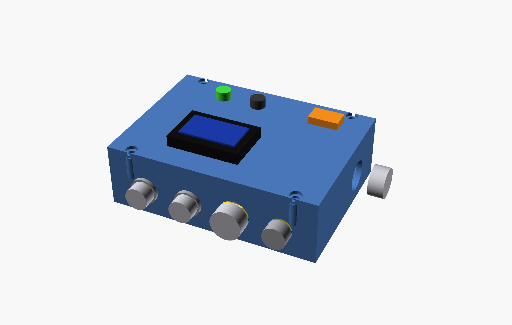
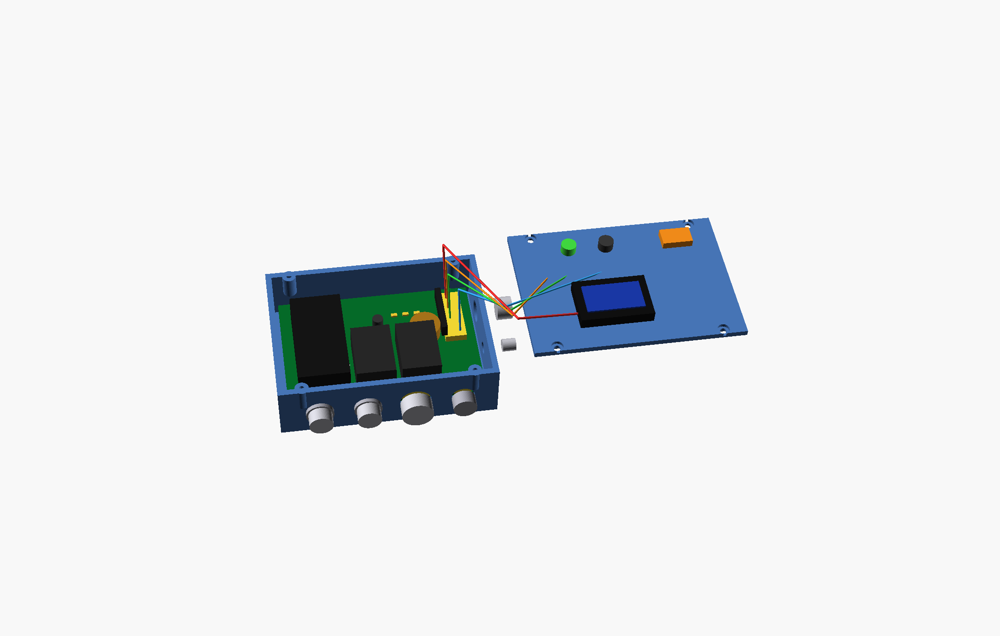

# Screwdriver Antenna Auto Tuner

An ESP32-based automatic controller for motorized HF screwdriver antennas.

This repository contains the firmware, generated KiCad design files, enclosure
model, sourcing notes, build documentation, renders, and fabrication outputs for
an in-vehicle automatic antenna tuner with:

- ESP32 control logic
- OLED status display
- motor drive with current-based stall detection
- SWR measurement using an onboard directional coupler
- detachable radio and antenna harnesses
- Tarheel-style sensor support via the 4-wire antenna connector

## Current revision highlights

- single-mode auto-tuner firmware with TUNE, PARK, and jog controls
- power-stage revision to the Murata OKI-78SR fixed 3.3 V regulator
- external SWR jack removed from the PCB revision
- updated enclosure previews and board renders
- regenerated Gerber package in `fab/tuner_gerbers.zip`
- printable enclosure assets can be exported directly from OpenSCAD, with 3MF
	files generated for the current base and lid geometry

## Screenshots

Board render:



Assembled enclosure preview:



Service-open enclosure preview:



## Repository layout

- `firmware/` — PlatformIO firmware, simulation wiring, and firmware spec
- `hardware/` — assembly guide, BOM, sourcing, routing notes, enclosure model
- `hardware/kicad/` — generated KiCad schematic, PCB, netlist, DSN, footprints
- `renders/` — board and enclosure images plus schematic and PCB PDFs
- `fab/` — generated Gerbers and fabrication ZIP package
- `scripts/` — source-of-truth generators for schematic, PCB, BOM, and fab outputs

## Quick start

1. Read the hardware requirements and build notes in `hardware/ASSEMBLY.md`.
2. Review the firmware contract in `firmware/FIRMWARE_SPEC.md`.
3. Build firmware from `firmware/` with PlatformIO.
4. If you are fabricating the PCB, use `fab/tuner_gerbers.zip`.
5. If you are printing the enclosure, use the generated 3MF files in
	`hardware/enclosure/` or export fresh parts from `hardware/enclosure/enclosure.scad`.

## First-time builder checklist

1. Read `hardware/ASSEMBLY.md` start to finish before soldering anything.
2. Confirm you are building the **Murata OKI-78SR** power-stage revision, not the older adjustable U1 variant.
3. Order parts from `hardware/BOM.csv` and review substitutions in `hardware/SOURCING.md`.
4. Verify your enclosure connector choices against `hardware/RADIO_CONNECTOR.md` and `hardware/enclosure/README.md`.
5. Print or export the enclosure parts you want before final panel-harness lengths are cut.
6. Build and test the firmware in `firmware/` before final in-vehicle installation.
7. Power the assembled board from a current-limited bench supply first.
8. Program the ESP32 DevKit over USB and verify the OLED, buttons, PARK, and jog behavior before connecting the antenna.
9. Run `PARK` once after wiring a Tarheel-style sensor harness so the controller establishes home.

## Prerequisites

- Python 3 for the generator scripts
- PlatformIO for firmware builds
- KiCad CLI available through the configured Flatpak commands for schematic/PCB regeneration
- OpenSCAD for enclosure previews and print-file export

## Build and generation

Firmware build:

```bash
cd firmware
pio run
```

Firmware upload:

```bash
cd firmware
pio run -t upload
pio device monitor
```

Hardware regeneration from the repo root:

```bash
python3 scripts/gen_footprints.py
python3 scripts/gen_schematic.py
flatpak run --command=kicad-cli org.kicad.KiCad sch export netlist -o hardware/kicad/tuner.net hardware/kicad/tuner.kicad_sch
flatpak run --command=python3 org.kicad.KiCad scripts/gen_pcb.py
flatpak run --command=python3 org.kicad.KiCad scripts/export_dsn.py
python3 scripts/gen_bom.py
python3 scripts/gen_gerbers.py
```

Enclosure print export:

```bash
cd hardware/enclosure
openscad -D 'part="base"' -o base.stl enclosure.scad
openscad -D 'part="lid"' -o lid.stl enclosure.scad
openscad -D 'part="both"' -o enclosure_full.stl enclosure.scad
openscad -D 'part="base"' -o base.3mf enclosure.scad
openscad -D 'part="lid"' -o lid.3mf enclosure.scad
openscad -D 'part="both"' -o enclosure_full.3mf enclosure.scad
```

## Primary documentation

- `firmware/FIRMWARE_SPEC.md`
- `firmware/src/README.md`
- `hardware/ASSEMBLY.md`
- `hardware/SOURCING.md`
- `hardware/RADIO_CONNECTOR.md`
- `hardware/enclosure/README.md`

## Fabrication outputs

- PCB fabrication ZIP: `fab/tuner_gerbers.zip`
- Individual Gerbers/drill files: `fab/gerbers/`
- Enclosure print files: `hardware/enclosure/base.stl`, `hardware/enclosure/lid.stl`, `hardware/enclosure/enclosure_full.stl`, `hardware/enclosure/base.3mf`, `hardware/enclosure/lid.3mf`, `hardware/enclosure/enclosure_full.3mf`
- Board and enclosure previews: `renders/`

## Programming the ESP32

This design uses an ESP32 DevKit module as `U2`, so the easiest programming path
is through the DevKit's normal USB port.

Typical workflow:

1. Assemble the board and fit the ESP32 DevKit at `U2`.
2. Power the board from a current-limited 12 V bench supply for first bring-up.
3. Connect the ESP32 DevKit USB port to your computer.
4. From the `firmware/` directory, run:

```bash
pio run -t upload
pio device monitor
```

If you ever need direct serial flashing instead of the DevKit USB connector, use
the debug UART header `J8` with a 3.3 V USB-to-UART adapter.

Recommended `J8` signals:

- pin 1 = GND
- pin 2 = 3V3
- pin 3 = TX from ESP32
- pin 4 = RX to ESP32

For most builds, you do **not** need to power the ESP32 through `J8`; just share
ground and use the DevKit USB interface unless you have a special recovery case.

## Notes

- The generated KiCad files in `hardware/kicad/` are derived artifacts; the
	Python scripts in `scripts/` are the source of truth.
- For vehicle use, internal board wiring should be direct-soldered and strain
	relieved rather than using loose jumper leads.
- The pre-generated STL and 3MF files are convenience outputs for the current
	enclosure geometry; regenerate them from `hardware/enclosure/enclosure.scad` if
	you change any enclosure parameters. `enclosure_full.3mf` and
	`enclosure_full.stl` contain the base and lid together as one combined export.
