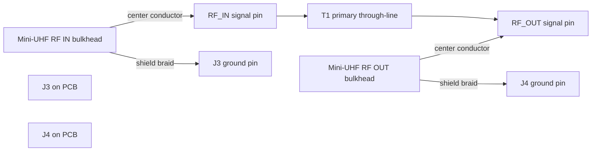
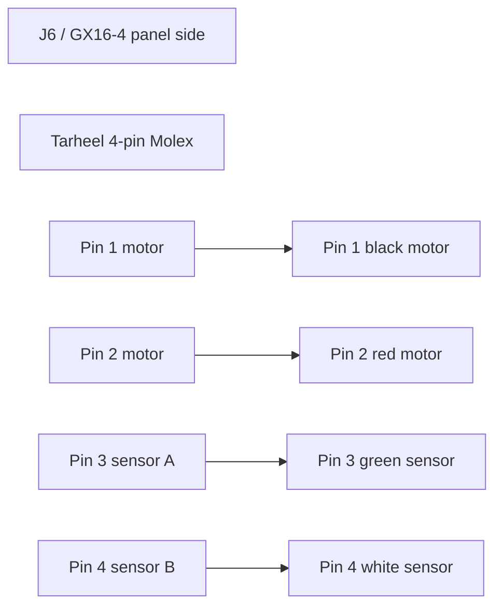

# Assembly Guide — ESP32 Screwdriver Antenna Tuner

A step-by-step build for the tuner PCB. The board is **mixed-technology**: mostly
hand-solderable 0805 SMD passives + a few SMD ICs, then through-hole headers, a
hand-wound toroid, and three socketed modules. Work **lowest-profile parts first**
so nothing blocks your iron later, and **test between the major stages** so a fault
is easy to localize.

- **Skill:** basic SMD soldering (0805, SOT-23, SOIC). Everything was chosen to be
  hand-solderable — no leadless/QFN, no thermal pads (those live on the modules).
- **Time:** ~2–4 hours for the board, plus winding T1 and panel wiring.
- **References:** `BOM.csv` (the **Ref** column = the tag on each part; the
  **Designators** column lists every position it populates), `renders/pcb_routed_top.png`
  (placement), `SOURCING.md` (where to buy), `RADIO_CONNECTOR.md` + `enclosure/README.md`
  (panel wiring), `firmware/FIRMWARE_SPEC.md` (bring-up).

---

## Tools & supplies

- Fine-tip soldering iron (~0.4 mm) **or** hot-air/hotplate + solder paste.
- Thin solder (0.5 mm), **flux** (essential for SMD), solder wick, IPA + brush.
- Fine tweezers, magnification (loupe/microscope helps for 0805).
- Multimeter (continuity + voltage). **Bench PSU with current limit** for first power-up.
- 0.3 mm (≈30 AWG) enamelled wire for T1; a short length of stiff hookup wire for
  the T1 primary; 2.54 mm header strip + Dupont/ribbon for panel wiring.

> **ESD:** the ESP32, MAX3232, INA180 and DRV8871 are static-sensitive — use a
> grounded mat/strap, especially in dry/winter conditions.

---

## Orientation

Hold the board with the silkscreen readable. Landmarks (top copper render):
**U2 (ESP32) down the left edge · connectors (J3 J4 J1 J6 J8) along the top ·
U1 buck top-center · U4 motor carrier center · T1 toroid + detectors center-right ·
U3 (MAX3232) right · the UI header row (J_OLED SW1 SW2 J_TUNE) along
the bottom · 4× M3 mounting holes at the corners.**

Every part's reference designator is on the silkscreen. Pin-1 / polarity marks are
on silk too — match them exactly for the polarized parts flagged below.

---

## Stage 1 — SMD passives (flattest first, non-polarized)

These don't care about orientation, but 0805 R/C are **unmarked** — keep each value
in its own labeled dish and do one value at a time.

**1a. Resistors (0805):**
| Ref | Qty | Value | Positions |
|-----|----:|-------|-----------|
| R3 | 1 | 150 Ω | R3 |
| R4 | 3 | 1 kΩ | R4,R_SA,R_SB |
| R5 | 6 | 4.7 kΩ | R5,R6,R12,R13,R_CIV1,R_CIV3 |
| R7 | 9 | 10 kΩ | R7,R8,R_CIV2,R_EN,R_IO12,R_TD,R_TU,R_SA_PU,R_SB_PD |

**1b. MLCC capacitors (0805):**
| Ref | Qty | Value | Positions |
|-----|----:|-------|-----------|
| C3 | 10 | 100 nF | C3,C5,C6,C11,C12,C13,C14,C15,C_EN,C_INA |
| C4 | 1 | 10 µF | C4 |
| C7 | 1 | 3.3 pF | C7 |
| C8 | 1 | 100 pF | C8 |
| C9 | 2 | 1 nF | C9,C10 |

**Technique (hand):** flux a pad, tin it, tack one end of the part, then solder the
other end and re-flow the first. **Technique (paste):** paste + place all, then
hot-air or hotplate reflow this whole stage at once.

✅ *Check:* every R/C value landed on the right designators (compare to the table).

---

## Stage 2 — SMD semiconductors & power SMD (orientation matters)

**2a. Non-polarized but distinct packages:**
| Ref | Part | Package | Note |
|-----|------|---------|------|
| R_SH | WSL2512R0500FEA | 2512 | 0.05 Ω shunt — lots of heat, flood the pads |
| F1 | 1812L300/24SLER | 1812 | resettable fuse |

**2b. Diodes — match the cathode band to the silkscreen mark:**
| Ref | Part | Package | Orientation |
|-----|------|---------|-------------|
| D1 | SMBJ13A-E3/52 (TVS) | SMB | **unidirectional** — band (cathode) to the `+12V` side per silk |
| D2,D3 | BAT46WS (Schottky) | SOD-323 | band (cathode) to the silk cathode line |

**2c. Transistors / ICs — match pin 1 (dot/notch) to the silk pin-1 mark:**
| Ref | Part | Package |
|-----|------|---------|
| Q1,Q2 | MMBT3904LT1G | SOT-23 |
| U6 | INA180A1IDBVR | SOT-23-5 |
| U3 | MAX3232ESE+ | SOIC-16 (pin-1 dimple toward the silk dot) |

> SOIC tip: tack two opposite corners first, check it's seated square, then drag-
> solder each side with plenty of flux; wick any bridges.

✅ *Check:* D1/D2/D3 band direction; Q/U pin-1; no SOIC bridges (inspect under light).

---

## Stage 3 — SMD electrolytics (tallest SMD — **polarized**)

| Ref | Qty | Value | Positions |
|-----|----:|-------|-----------|
| C1 | 2 | 100 µF 25 V | C1, C_VM |
| C2 | 1 | 47 µF 16 V | C2 |

**Polarity:** these are SMD aluminium cans — the bevelled/marked corner is the
**negative** terminal. Match it to the silkscreen polarity (the `-` / unfilled pad;
`+` is the square/striped pad). Getting this wrong = bulged cap on power-up.

✅ *Check:* all three caps' polarity against silk. This finishes the SMD side —
clean off flux with IPA and inspect the whole board before going through-hole.

---

## Stage 4 — Through-hole: headers and module sockets

The UI controls and most connectors are **2.54 mm headers** (the actual switches,
OLED and Mini-UHF bulkheads are panel-mounted and wired to these — Stage 7).

**4a. Board headers** — solder vertical 2.54 mm headers at every position below.
Use **female** sockets if you want the panel controls to plug in, or male pins to
solder flying leads to:
| Positions | Pins | Function |
|-----------|------|----------|
| J1,J3,J4 | 1×02 | power in / RF in / RF out |
| J2 | 1×06 | universal radio (→ panel GX16) |
| J6,J8,J_OLED | 1×04 | antenna I/O / debug UART / OLED |
| J_TUNE | 1×03 | jog rocker |
| SW1, SW2 | 1×02 | TUNE / PARK buttons |

> The BOM lists the **panel parts** (PTS645 buttons) as the MPNs for SW1/SW2, since
> those mount on the enclosure. You still need plain 2.54 mm header strip for the
> *board* side of those positions — grab a 40-pin strip.
> *(Pure auto-tuner: the rotary encoder, MODE switch and hall connector are gone.)*

### Vehicle-grade note for this revision

For a mobile installation, do **not** rely on loose Dupont-style jumper leads as
the final internal wiring method. Vehicle vibration can work friction-only jumper
connections loose over time.

Recommended approach for this PCB revision:

- For **J1, J2, J3, J4, and J6**, solder the internal harness wires directly into
   the board holes instead of using loose plug-on jumpers.
- Put the **detachable interface at the panel connector** (GX16, Mini-UHF, power
   jack), not at the board header.
- Add **strain relief** close to the PCB using a tie-down, adhesive mount, lacing,
   silicone, or similar support so the solder joints do not carry cable flex.
- Twist the appropriate signal/return pairs and keep them anchored so they cannot
   vibrate against the board or enclosure.

For this revision, the only places where removable board-side connections still
make sense are the socketed modules **U1**, **U2**, and **U4**, plus any lid-side
controls if you specifically want service-open access.

If you plan a future board respin for harsher mobile service, replace the plain
2.54 mm board headers with **locking wire-to-board connectors** rather than loose
friction headers.

**4b. Module sockets:** solder **female header strip** into the U1, U2, U4 module
footprints so the modules are removable (recommended over soldering modules
directly). Match the socket rows to the module footprints exactly.

✅ *Check:* headers sit square (tack one pin, straighten, then solder the rest);
no solder in the module socket holes you'll plug into.

---

## Stage 5 — Wind & install T1 (SWR coupler)

T1 is a 1 : 30, centre-tapped current transformer on a **Fair-Rite 5943000201
(FT37-43)** core. Five pads: **P1, P2** = 1-turn primary (the RF through-line);
**S1, SCT, S2** = the ~30-turn centre-tapped secondary.

1. **Secondary:** wind **30 turns** of 0.3 mm enamelled wire evenly around the core.
   At the **15th turn**, pull out a small twisted loop and leave it as the
   **centre-tap (SCT)** lead. Winding start = **S1**, the loop = **SCT**, the
   end (turn 30) = **S2**. *(Confirm turns/tap against the schematic if in doubt.)*
2. Scrape/tin the enamel off all three secondary leads.
3. **Primary:** pass a single length of stiff hookup wire **once** through the core's
   centre — that one pass = the 1-turn primary. Its two ends go to **P1** and **P2**.
4. Insert all leads into their pads (S1/SCT/S2 + the primary into P1/P2) and solder.
   The primary carries full TX current — use a decent-gauge wire and good joints.

✅ *Check:* secondary leads in the right pads (S1/SCT/S2), primary is one clean turn,
no enamel left on tinned ends.

---

## Stage 6 — Configure & fit the modules (no heat — plug-in)

**Do U1 first and confirm its orientation BEFORE it powers the logic.**

1. **U1 (Murata OKI-78SR-3.3/1.5-W36-C):** this is a **fixed-output 3.3 V SIP
   regulator**, so there is no trimpot to adjust. Verify the pin orientation before
   fitting: **pin 1 = VIN**, **pin 2 = GND**, **pin 3 = VOUT**. Fit it to the U1
   footprint so 12 V enters VIN and 3.3 V leaves VOUT.
2. **U4 (Pololu DRV8871 #2990):** orient VIN/GND/IN1/IN2/OUT1/OUT2 to the silk and
   seat it.
3. **U2 (ESP32 DevKit):** orient so the silk pin names (3V3, GND, D15 …) line up
   (USB end toward the board edge for cable access) and seat it.

✅ *Check:* every module's pin order matches its socket; nothing offset by a row.

---

## Stage 7 — Panel components & wiring (in the enclosure)

Mount the panel parts on the printed enclosure and wire each to its board header
with short flying leads (see `enclosure/README.md` for the cutout layout and
`RADIO_CONNECTOR.md` for the radio connector):

- **OLED** → J_OLED · **TUNE button** → SW1 · **PARK button** → SW2 ·
  **jog rocker** → J_TUNE.
- **Radio:** panel **GX16** → J2 (universal — see RADIO_CONNECTOR.md pinout).
- **RF:** 2× **Mini-UHF bulkhead** → J3 (in) / J4 (out). Keep these leads **short**; the J3→T1
  primary→J4 path carries TX power.
- **Power:** 12 V panel jack → J1.
- **Antenna:** J6 → **GX16-4 panel bulkhead** (motor + optional sensor pair).

> Twist signal/return pairs; keep the RF and motor leads away from the SWR detector
> and ADC wiring.

> For in-vehicle use, treat those board connections as **direct-solder harness
> terminations with strain relief**, not as loose internal jumper leads.

> Board-side RF connection is via the 2-pin headers/pads at J3 and J4 (signal +
> ground), not a dedicated coax board jack. Use short RG-316 pigtails from each
> Mini-UHF bulkhead: center conductor to RF signal pin, shield to GND pin.

### RF pigtail wiring diagram (Mini-UHF panel bulkheads)

Keep each RG-316 run as short as practical and avoid tight bends at the board edge.

> If your station cabling is SO-239/PL-259, use compact Mini-UHF<->UHF adapters at
> the panel connectors.

> For antenna compatibility (Tarheel and others), make external adapter leads from
> GX16-4 to the antenna's expected motor plug/termination, keeping the panel-side
> interface consistent and detachable.

### Tarheel adapter harness (GX16-4 -> Tarheel 4-pin Molex)

Tarheel antennas commonly use a 4-pin inline Molex-style connector with:

- Pin 1 = Black = motor
- Pin 2 = Red = motor
- Pin 3 = Green = sensor
- Pin 4 = White = sensor

This tuner revision supports the **sensor pair** as an optional pulse-feedback
input. It assumes the green/white pair behaves like a dry contact or open-collector
pulse source. If no valid pulses appear, firmware falls back to stall-only tuning.

Build the adapter lead as:

- GX16-4 pin 1 -> Tarheel pin 1 (black motor)
- GX16-4 pin 2 -> Tarheel pin 2 (red motor)
- GX16-4 pin 3 -> Tarheel pin 3 (green sensor)
- GX16-4 pin 4 -> Tarheel pin 4 (white sensor)

If jog direction is reversed in practice, swap the two motor wires.

Use the Tarheel Molex kit shell/pins plus a short 4-conductor adapter cable. Run
`PARK` once after installation so the firmware can establish a zero reference,
then later tune sweeps can use the pulse feedback for more repeatable returns.

---

## Stage 8 — Inspection & power-on test

1. **Visual:** re-check every polarized part (D1/D2/D3 bands, C1/C2/C_VM polarity),
   pin-1 on Q/U, module orientation, and scan for bridges/cold joints.
2. **Continuity (power off):** `+12V`↔`GND` **not** shorted; `+3V3`↔`GND` **not**
   shorted.
3. **First power:** bench PSU at **12 V, current limit ~0.3–0.5 A**. It should draw
   little and **not get hot**. Measure **`+3V3` = 3.3 V** at U1 output. If current
   slams to the limit or anything heats — power off, find the short.
4. **Logic alive:** the ESP32 should boot (onboard LED / USB-serial console on the
   debug UART, J8 / GPIO1-3).
5. **Flash firmware** (`firmware/FIRMWARE_SPEC.md`), then verify: OLED draws,
   TUNE/PARK and jog UP/DOWN respond, motor jogs (motor connected, in-line fuse),
   SWR reads with RF applied.

---

## Stage 9 — Calibration & first tune

- **SWR cal:** with a 50 Ω dummy load (= SWR 1.0) and a known mismatch, run the
  firmware's SWR calibration to fit the detector curve (stored in NVS).
- **Motor:** set the stall-current threshold and verify stall-end-stop detection
   for PARK (downward travel) and sweep reversal during TUNE.
- **Radio:** let auto-detect identify your rig (CI-V / Kenwood / Yaesu); confirm
  frequency reads correctly.
- Do a live **TUNE** into the antenna at low power and verify final status/SWR on
   the OLED.

---

## Polarity / pin-1 cheat-sheet

| Part | Watch |
|------|-------|
| D1 SMBJ13A | cathode band → `+12V` side |
| D2,D3 BAT46WS | cathode band → silk cathode |
| C1,C2,C_VM | SMD alu: marked/bevelled corner = **negative** |
| Q1,Q2 / U6 / U3 | pin-1 dot/notch → silk pin-1 |
| U1 / U2 / U4 modules | IN/OUT / pin-name order → silk |
| T1 | S1/SCT/S2 secondary, P1/P2 primary (1 turn) |

## Troubleshooting

- **No 3.3 V / high current:** short on `+3V3` or `+12V`, a backwards electrolytic,
  or U1 mis-set/mis-oriented. Re-check Stage 3 & 6.
- **ESP32 won't boot:** U1 output wrong, U2 mis-seated, or GPIO12 held high (it's a
  boot strap — leave it). 
- **OLED blank:** address/orientation of the OLED module, or J_OLED wiring (SDA=GPIO4,
  SCL=GPIO5).
- **SWR reads garbage:** detector polarity (D2/D3), T1 winding/leads, or needs cal.
- **Motor runs one way only / not at all:** U4 IN1/IN2 wiring, or motor leads on J6.
- **No CAT/CI-V:** wrong cable wiring (RADIO_CONNECTOR.md), or CI-V invert flag in
  firmware (flip it), or baud — let auto-detect run.
